# MEMO IN THE AIR

 

  

 

  <b>증강 현실(AR) 속 원하는 공간에 메모를 기록</b>하는 React Native iOS전용 모바일 애플리케이션
   

 
 

# 목차

<!-- toc -->

- [프로젝트 기획 동기](#%ED%94%84%EB%A1%9C%EC%A0%9D%ED%8A%B8-%EA%B8%B0%ED%9A%8D-%EB%8F%99%EA%B8%B0)
- [AR(증강 현실)과 VR(가상 현실)의 차이점](#ar%EC%A6%9D%EA%B0%95-%ED%98%84%EC%8B%A4%EA%B3%BC-vr%EA%B0%80%EC%83%81-%ED%98%84%EC%8B%A4%EC%9D%98-%EC%B0%A8%EC%9D%B4%EC%A0%90)
- [기술 스택](#%EA%B8%B0%EC%88%A0-%EC%8A%A4%ED%83%9D)
- [UI 미리보기](#ui-%EB%AF%B8%EB%A6%AC%EB%B3%B4%EA%B8%B0)
- [구현 기능](#%EA%B5%AC%ED%98%84-%EA%B8%B0%EB%8A%A5)
  - [1. 비회원 서비스 기반의 애플리케이션 설계와 구현](#1-%EB%B9%84%ED%9A%8C%EC%9B%90-%EC%84%9C%EB%B9%84%EC%8A%A4-%EA%B8%B0%EB%B0%98%EC%9D%98-%EC%95%A0%ED%94%8C%EB%A6%AC%EC%BC%80%EC%9D%B4%EC%85%98-%EC%84%A4%EA%B3%84%EC%99%80-%EA%B5%AC%ED%98%84)
    - [1-1. 다른 사용자와 구별할 수 있는 사용자만의 고유한 정보 파악하기](#1-1-%EB%8B%A4%EB%A5%B8-%EC%82%AC%EC%9A%A9%EC%9E%90%EC%99%80-%EA%B5%AC%EB%B3%84%ED%95%A0-%EC%88%98-%EC%9E%88%EB%8A%94-%EC%82%AC%EC%9A%A9%EC%9E%90%EB%A7%8C%EC%9D%98-%EA%B3%A0%EC%9C%A0%ED%95%9C-%EC%A0%95%EB%B3%B4-%ED%8C%8C%EC%95%85%ED%95%98%EA%B8%B0)
    - [1-2. 사용자의 정보를 기억하는 방법 : `expo-secure-store`](#1-2-%EC%82%AC%EC%9A%A9%EC%9E%90%EC%9D%98-%EC%A0%95%EB%B3%B4%EB%A5%BC-%EA%B8%B0%EC%96%B5%ED%95%98%EB%8A%94-%EB%B0%A9%EB%B2%95--expo-secure-store)
  - [2. 지도를 활용한 직관적인 메모 목록 구현](#2-%EC%A7%80%EB%8F%84%EB%A5%BC-%ED%99%9C%EC%9A%A9%ED%95%9C-%EC%A7%81%EA%B4%80%EC%A0%81%EC%9D%B8-%EB%A9%94%EB%AA%A8-%EB%AA%A9%EB%A1%9D-%EA%B5%AC%ED%98%84)
    - [2-1. 마커 클러스터링(marker-clustering)이란?](#2-1-%EB%A7%88%EC%BB%A4-%ED%81%B4%EB%9F%AC%EC%8A%A4%ED%84%B0%EB%A7%81marker-clustering%EC%9D%B4%EB%9E%80)
    - [2-2. 지도를 활용하여 메모 목록의 상세 정보 보여주기](#2-2-%EC%A7%80%EB%8F%84%EB%A5%BC-%ED%99%9C%EC%9A%A9%ED%95%98%EC%97%AC-%EB%A9%94%EB%AA%A8-%EB%AA%A9%EB%A1%9D%EC%9D%98-%EC%83%81%EC%84%B8-%EC%A0%95%EB%B3%B4-%EB%B3%B4%EC%97%AC%EC%A3%BC%EA%B8%B0)
- [문제 해결](#%EB%AC%B8%EC%A0%9C-%ED%95%B4%EA%B2%B0)
  - [1. AR 구현 라이브러리의 변경 : `react-viro` 에서 `AR.js` 로](#1-ar-%EA%B5%AC%ED%98%84-%EB%9D%BC%EC%9D%B4%EB%B8%8C%EB%9F%AC%EB%A6%AC%EC%9D%98-%EB%B3%80%EA%B2%BD--react-viro-%EC%97%90%EC%84%9C-arjs-%EB%A1%9C)
    - [1-1. `react-viro`를 선택했던 이유와 치명적인 문제 발생](#1-1-react-viro%EB%A5%BC-%EC%84%A0%ED%83%9D%ED%96%88%EB%8D%98-%EC%9D%B4%EC%9C%A0%EC%99%80-%EC%B9%98%EB%AA%85%EC%A0%81%EC%9D%B8-%EB%AC%B8%EC%A0%9C-%EB%B0%9C%EC%83%9D)
    - [1-2. 새로운 대안으로 웹 기반 라이브러리인 `AR.js` 채택](#1-2-%EC%83%88%EB%A1%9C%EC%9A%B4-%EB%8C%80%EC%95%88%EC%9C%BC%EB%A1%9C-%EC%9B%B9-%EA%B8%B0%EB%B0%98-%EB%9D%BC%EC%9D%B4%EB%B8%8C%EB%9F%AC%EB%A6%AC%EC%9D%B8-arjs-%EC%B1%84%ED%83%9D)
  - [2. 같은 위치에서 AR 화면 내 메모가 보였다가 사라지는 문제가 발생하는 이유는?](#2-%EA%B0%99%EC%9D%80-%EC%9C%84%EC%B9%98%EC%97%90%EC%84%9C-ar-%ED%99%94%EB%A9%B4-%EB%82%B4-%EB%A9%94%EB%AA%A8%EA%B0%80-%EB%B3%B4%EC%98%80%EB%8B%A4%EA%B0%80-%EC%82%AC%EB%9D%BC%EC%A7%80%EB%8A%94-%EB%AC%B8%EC%A0%9C%EA%B0%80-%EB%B0%9C%EC%83%9D%ED%95%98%EB%8A%94-%EC%9D%B4%EC%9C%A0%EB%8A%94)
    - [2-1. 사용자의 위치가 매번 다르게 반환되는 이유](#2-1-%EC%82%AC%EC%9A%A9%EC%9E%90%EC%9D%98-%EC%9C%84%EC%B9%98%EA%B0%80-%EB%A7%A4%EB%B2%88-%EB%8B%A4%EB%A5%B4%EA%B2%8C-%EB%B0%98%ED%99%98%EB%90%98%EB%8A%94-%EC%9D%B4%EC%9C%A0)
    - [2-2. 사용자가 직접 자신의 위치를 설정하도록 하여 위치 정확도를 높이자.](#2-2-%EC%82%AC%EC%9A%A9%EC%9E%90%EA%B0%80-%EC%A7%81%EC%A0%91-%EC%9E%90%EC%8B%A0%EC%9D%98-%EC%9C%84%EC%B9%98%EB%A5%BC-%EC%84%A4%EC%A0%95%ED%95%98%EB%8F%84%EB%A1%9D-%ED%95%98%EC%97%AC-%EC%9C%84%EC%B9%98-%EC%A0%95%ED%99%95%EB%8F%84%EB%A5%BC-%EB%86%92%EC%9D%B4%EC%9E%90)
- [챌린지](#%EC%B1%8C%EB%A6%B0%EC%A7%80)
  - [1. AR 화면을 통해 정확한 위치에 메모 띄우기](#1-ar-%ED%99%94%EB%A9%B4%EC%9D%84-%ED%86%B5%ED%95%B4-%EC%A0%95%ED%99%95%ED%95%9C-%EC%9C%84%EC%B9%98%EC%97%90-%EB%A9%94%EB%AA%A8-%EB%9D%84%EC%9A%B0%EA%B8%B0)
    - [1-1. 사용자와 메모 간 거리 계산 과정에서의 시행착오](#1-1-%EC%82%AC%EC%9A%A9%EC%9E%90%EC%99%80-%EB%A9%94%EB%AA%A8-%EA%B0%84-%EA%B1%B0%EB%A6%AC-%EA%B3%84%EC%82%B0-%EA%B3%BC%EC%A0%95%EC%97%90%EC%84%9C%EC%9D%98-%EC%8B%9C%ED%96%89%EC%B0%A9%EC%98%A4)
    - [1-2. 여전히 정확하지 않은 메모의 위치 문제](#1-2-%EC%97%AC%EC%A0%84%ED%9E%88-%EC%A0%95%ED%99%95%ED%95%98%EC%A7%80-%EC%95%8A%EC%9D%80-%EB%A9%94%EB%AA%A8%EC%9D%98-%EC%9C%84%EC%B9%98-%EB%AC%B8%EC%A0%9C)
- [회고](#%ED%9A%8C%EA%B3%A0)

<!-- tocstop -->

 

# 프로젝트 기획 동기

특정 장소와 연관된 사소한 생각이나 정보를 기록하고 싶을 때, 그 내용을 장소에 저장하는 메모 애플리케이션은 많습니다. 그러나 대부분은 시간과 텍스트 중심으로 되어있어, 특정 장소와 연결된 메모를 시각적으로 남기는 데는 한계가 있었습니다. 그래서 "특정 공간에 가상의 메모를 띄우면 어떨까?"라는 생각을 하게 되었습니다.

장소와 메모를 연결하는 새로운 경험을 제공하기 위해, AR을 활용하여 특정 공간에 가상의 메모를 기록할 수 있는 모바일 애플리케이션을 기획하게 되었습니다.

 

# AR(증강 현실)과 VR(가상 현실)의 차이점

- AR(Augmented Reality) : 증강 현실
  - 현실 배경 또는 이미지에 컴퓨터가 만든 가상의 정보를 덧띄우는 기술
- VR(Virtual Reality) : 가상 현실
  - 컴퓨터를 통해 만들어진 가상 세계를 사용자에게 제공하여 가상 세계를 현실처럼 생생히 체험할 수 있는 기술

**MEMO IN THE AIR**은 사용자의 휴대폰 카메라를 통해 특정 공간에 가상의 메모를 띄우고 확인하는 AR 애플리케이션입니다.

 

# 기술 스택

<table>
  <tr>
    <td><b>App</b></td>
    <td>     </td>
  </tr>
  <tr>
    <td><b>Web</b></td>
    <td></td>
  </tr>
</table>

 
 

# UI 미리보기

<table>
  <tr>
    <td width="25%">메인 화면</td>
    <td width="25%">사용자 위치 파악 화면</td>
    <td width="25%">AR 화면</td>
    <td width="25%">AR 화면 - 그리드</td>
  </tr>
  <tr>
    <td>
      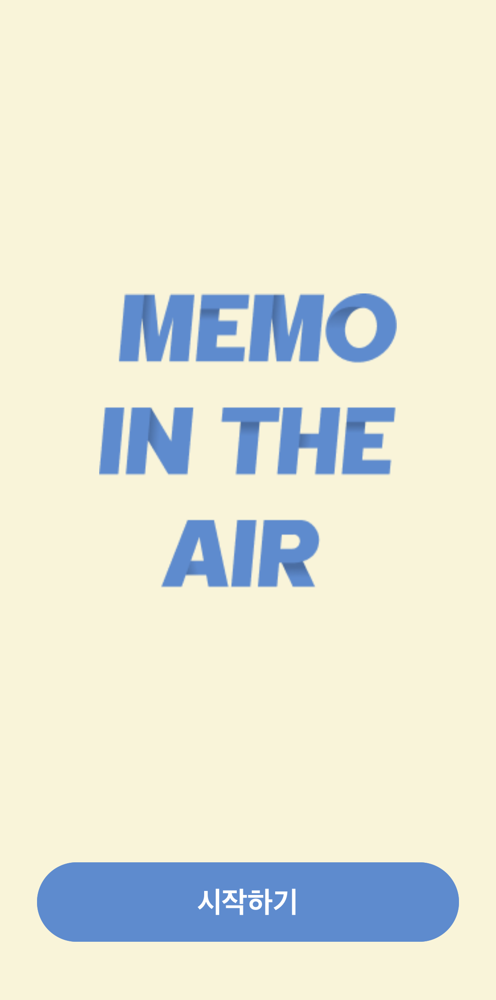
    </td>
    <td>
      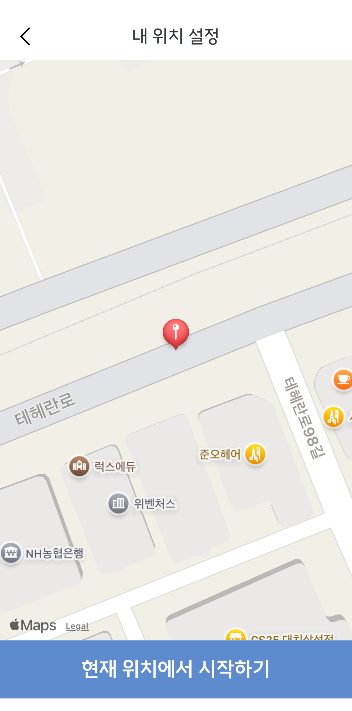
    </td>
    <td>
      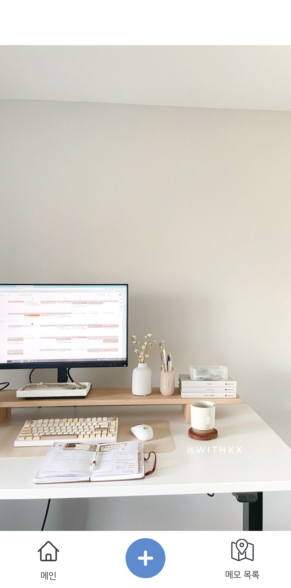
    </td>
    <td>
      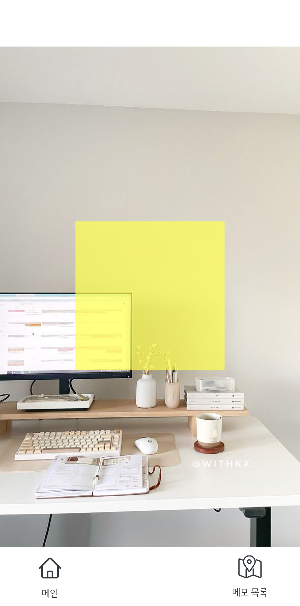
    </td>
  </tr>
  <tr>
    <td width="25%">메모 등록 화면</td>
    <td width="25%">메모 목록 화면</td>
    <td width="25%">메모 목록 모달</td>
    <td width="25%"></td>
  </tr>
  <tr>
    <td>
      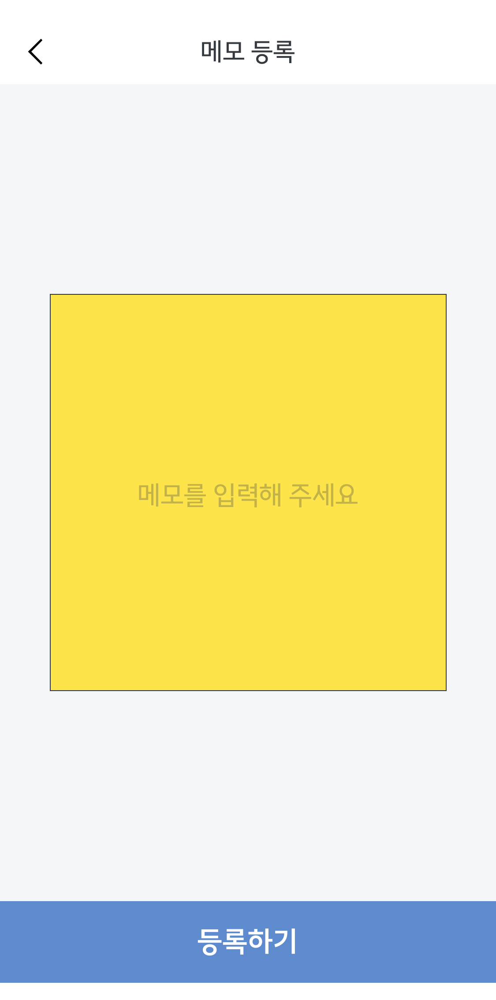
    </td>
    <td>
      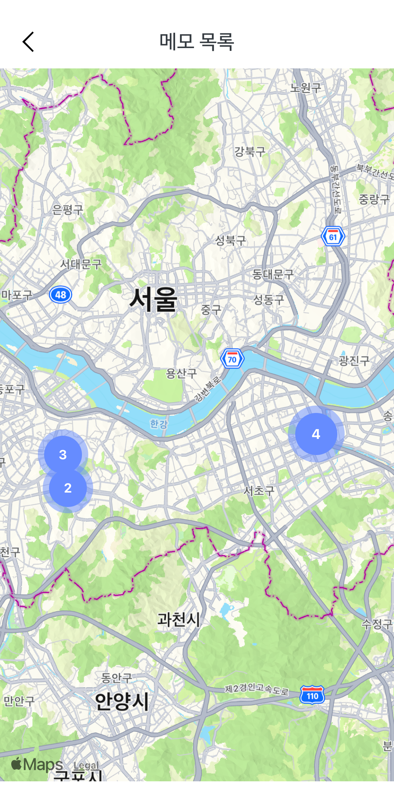
    </td>
    <td>
      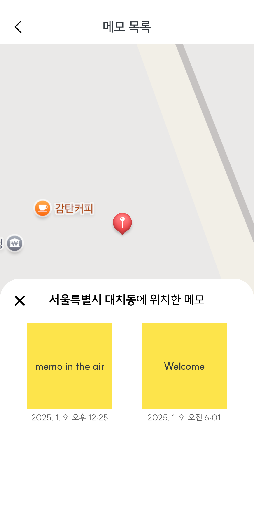
    </td>
    <td>
    </td>
  </tr>
</table>

 

# 구현 기능

## 1. 비회원 서비스 기반의 애플리케이션 설계와 구현

`UUID`와 `expo-secure-store`를 활용하여 회원가입 없이도 서비스를 이용할 수 있도록 했습니다.

기획 단계에서 앱스토어에 등록된 무료 메모 앱들을 파악했을 때, 회원가입이나 로그인 없이도 서비스를 제공하는 앱이 많다는 것을 파악하게 되었습니다. 해당 사항을 참고하여 누구나 자유롭게 AR 기능을 체험하고 메모를 자유롭게 등록할 수 있도록, 회원가입 없이도 사용할 수 있는 앱을 기획하게 되었습니다.

이를 위해선 다음 두 가지 조건을 충족해야 했습니다.

1. 사용자를 식별할 수 있는 고유 정보를 파악할 수 있어야 한다.
2. 앱 종료 후에도 고유 정보를 기억하여, 재실행 시에도 동일 사용자로 파악되어야 한다.

 

### 1-1. 다른 사용자와 구별할 수 있는 사용자만의 고유한 정보 파악하기

React Native 앱에서는 디바이스의 정보를 파악할 수 있는 `expo-device` 라이브러리가 있지만, 디바이스의 고유 ID를 제공하지 않기 때문에 적합하지 않았습니다. 이에 따라, 고유성이 보장되는 `UUID 버전 4`를 사용하여 앱 실행 시 사용자별 고유 ID를 생성하는 방법을 채택하였습니다.

  
UUID 생성 코드

  

    import { v4 } from "uuid";

    export function createUUID(): string {
      return v4();
    }

  

 

### 1-2. 사용자의 정보를 기억하는 방법 : `expo-secure-store`

사용자의 고유 ID는 앱 종료나 재실행 시에도 유지되어야 했습니다. 기존에 저장된 ID가 없다면 신규 사용자로 인식하고 ID를 생성하며, 이미 저장된 ID가 있다면 기존 사용자의 ID를 불러와야 합니다. 이를 위해 `expo-secure-store` 라이브러리를 활용했습니다.

`expo-secure-store` 라이브러리는 데이터를 암호화하여 키-값 조합으로 디바이스에 영구적으로 저장하는 기능을 제공하므로, 앱이 업데이트되나 종료되어도 데이터를 안전하게 유지할 수 있습니다. 이러한 특성 덕분에 해당 라이브러리를 채택하게 되었습니다.

  
expo-secure-store를 통해 사용자의 ID를 앱에 저장하는 코드

  

    import * as SecureStore from "expo-secure-store";

    export async function checkUserId(): Promise<string> {
      let userId: string | null = await SecureStore.getItemAsync("userId");

      if (userId === null) {
        userId = createUUID();
        await SecureStore.setItemAsync("userId", JSON.stringify(userId));
      }

      return userId;
    }

  

 

**UUID**와 **expo-secure-store** 라이브러리를 함께 사용하여, 회원가입 없이도 사용자를 구분하고 사용자의 정보를 제공할 수 있는 구조를 구현하게 되었습니다.

 

## 2. 지도를 활용한 직관적인 메모 목록 구현

이 서비스는 장소 기반 메모 애플리케이션이므로, 메모를 단순히 정렬해 보여주는 대신 지도 위에 표시하는 방식이 더 직관적이라고 판단되어 지도를 사용하였습니다. 그리고 마커 클러스터링(marker-clustering)을 통해 비슷한 위치에 등록된 메모의 수를 쉽게 파악할 수 있도록 구현하였습니다.

### 2-1. 마커 클러스터링(marker-clustering)이란?

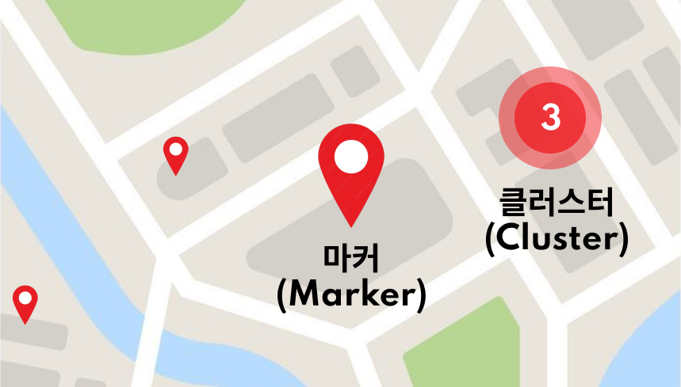

- 마커(Marker): 지도에 올라가는 핀 모양의 이미지
- 클러스터(Cluster): 여러 마커가 근접하여 표시될 때, 해당 마커들을 하나의 그룹으로 묶어서 표시하는 기능

 
마커 클러스터링이란 지도에 있는 여러 마커를 하나의 아이콘으로 통합하여 지도를 더 쉽게 이해할 수 있도록 돕는 기능입니다. 한 화면에 수많은 마커가 표시되면 성능 저하될 뿐만 아니라 마커가 겹치며 지도에 대한 사용자의 이해도가 떨어질 수 있습니다. 마커 클러스터링을 사용하면 지도가 확대했을 때는 개별 마커로 표시해 사용자가 지도상의 정보를 명확히 파악할 수 있도록 하며, 축소되었을 때는 여러 개의 마커를 하나의 클러스터로 표시하여 간결한 지도 화면을 제공할 수 있습니다.

 
 

  
📍 마커 클러스터링 적용 전과 후의 화면 비교

  

    <table>
      <tr width="100%">
        <th width="50%">적용 전 화면</th>
        <th width="50%">적용 후 화면</th>
      </tr>
      <tr>
        <td>
          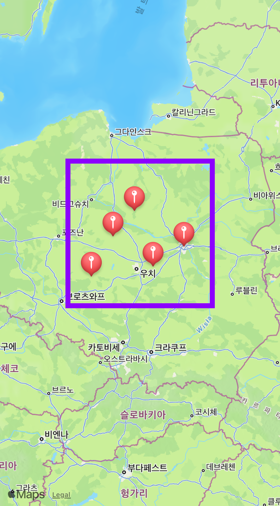
        </td>
        <td>
          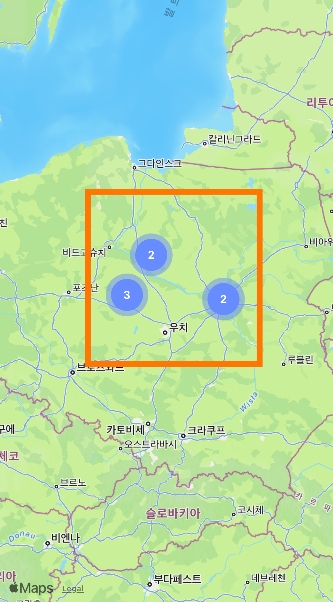
        </td>
      </tr>
    </table>
  

 

### 2-2. 지도를 활용하여 메모 목록의 상세 정보 보여주기

지도를 기반으로 한 메모 목록 화면에서 메모의 상세 정보를 사용자에게 더 직관적으로 제공할 방법에 대해 고민하게 되었습니다.

초기에 생각했던 방법은 대부분의 메모 애플리케이션과 유사하게 메모 내용만 표시되는 목록 화면으로 구현하는 것이었습니다. 이 방법을 생각한 이유는 사용자에게 익숙한 화면 방식을 따를 수 있기 때문이었습니다. 그러나 이 서비스는 장소 기반으로 한 애플리케이션이기 때문에, 대부분의 지도 애플리케이션의 동작 방식과 같이 사용자가 선택한 장소의 상세 정보는 지도 화면과 함께 표시되는 방법이 더 적합하다고 판단되었습니다. 따라서 지도 화면을 유지하면서 선택한 메모의 정보를 직관적으로 제공할 수 있도록 하단에 모달을 띄우는 방식을 채택하게 되었습니다.

사용자가 지도 화면에 표시된 마커 또는 클러스터를 클릭하면, 지도가 확대되며 선택한 위치가 지도의 중앙으로 이동하게 됩니다. 이 기능을 유지하기 위해 모달이 지도 화면의 절반을 넘지 않도록 구현하여 지도와 메모 목록이 함께 표시되도록 하였습니다. 확대된 지도와 함께 띄워진 모달 상단에 해당 위치의 시와 동 정보를 표시하여 사용자가 선택한 위치를 명확히 파악할 수 있도록 했습니다.

이를 통해 사용자가 선택한 위치의 메모 정보를 확인하는 동시에 그 위치와 주변 장소를 쉽게 파악할 수 있도록 구현했습니다.

  
메모 목록에서 모달을 적용한 메모 상세 정보 화면

  

    
  

 

# 문제 해결

## 1. AR 구현 라이브러리의 변경 : `react-viro` 에서 `AR.js` 로

### 1-1. `react-viro`를 선택했던 이유와 치명적인 문제 발생

프로젝트 초반 PoC(Proof of Concept) 단계에서 다음과 같은 이유로 `react-viro` 라이브러리를 선택하게 되었습니다.

1. React Native 라이브러리로, 설치 이외의 추가적인 작업이 필요하지 않다.
2. AR 환경에서 텍스트나 도형 등 가상의 물체를 자유롭게 수정 및 변형을 할 수 있으며, 원하는 좌표에 물체를 위치시킬 수 있는 기능을 지원한다.

`react-viro`는 초기 구현과 AR 화면에서 메모 위치를 표시하는 기능을 구현할 당시에는 적절한 선택이라고 생각했습니다. 그러나 메모 등록 화면 기능을 구현하면서 문제가 발생했습니다. AR 화면에서 메모 등록 화면으로 이동하면 앱이 <b>강제 종료</b>되는 현상이 확인되었습니다.

문제를 해결하기 위해 다음과 같은 사항들을 확인했습니다.

1. Router 문제  
   : AR 화면 이외 다른 화면 간의 이동은 정상적으로 동작했습니다.

2. 라이브러리 GitHub 이슈 확인  
   : 라이브러리의 GitHub에 동일한 이슈가 등록되어 있으나, 해결책에 대한 답변은 없었습니다.

3. 라이브러리 버전 다운그레이드  
   : 라이브러리의 버전을 낮춰 테스트를 진행했으나 동일한 문제는 재현되었습니다.

결론적으로, `react-viro` 라이브러리 자체 문제로 판단되었으며 해당 라이브러리의 문제를 해결할 시간이 부족했던 상황이었기에 검토했던 대안 중 하나였던 웹 기반 라이브러리인 `AR.js`를 선택하게 되었습니다.

 

### 1-2. 새로운 대안으로 웹 기반 라이브러리인 `AR.js` 채택

React Native의 다른 AR 라이브러리를 검토했으나 적합하지 않다고 판단되어, 웹에서 AR을 구현할 수 있는 라이브러리인 `AR.js`를 선택했습니다. 웹 AR 라이브러리이기 때문에 WebView를 기반으로 하여 AR 구현 테스트를 진행했습니다.

> WebView는 네이티브 화면에서 웹 콘텐츠를 렌더링하는 컴포넌트로, 웹 콘텐츠를 앱 화면과 함께 사용자에게 보여줄 수 있다.

AR.js의 예시 코드를 HTTPS 환경으로 배포한 후 WebView를 통해 테스트를 진행했고, 다음과 같은 결과를 확인할 수 있었습니다.

- WebView 내부에서 AR 화면이 정상적으로 동작한다.
- AR 화면 간의 페이지 이동과 관련된 문제가 발생하지 않는다.

이와 같은 결과를 바탕으로 AR.js 라이브러리를 채택하여 프로젝트를 원활하게 이어서 진행할 수 있게 되었습니다.

 

## 2. 같은 위치에서 AR 화면 내 메모가 보였다가 사라지는 문제가 발생하는 이유는?

AR 화면 내 메모를 띄우는 기능을 구현한 후, 여러 번의 테스트를 진행하면서 같은 위치에서도 메모의 위치가 변하거나 보이지 않는 현상이 발생했습니다. 이는 AR 화면 실행 전 사용자의 현재 위치를 파악하는 과정에서 매번 다른 좌표값이 반환되는 것을 파악하게 되었습니다.
 

  
AR 화면을 실행할 때마다 메모의 위치가 달라지는 실제 화면 예시

  

    
  

 

### 2-1. 사용자의 위치가 매번 다르게 반환되는 이유

실내 환경에서는 GPS 신호가 건물 구조물에 의해 차단되거나 굴절되며 정확한 신호 수신이 파악되지 않아, 사용자의 위치가 매번 다르게 반환됩니다.

이 서비스는 AR 화면에서 사용자 위치를 기반으로 동작합니다. 이를 위해 AR 화면으로 진입하기 전, 사용자의 위치를 파악하는 로딩 페이지를 구현했습니다. 그러나 같은 위치에서도 매번 다른 위치 데이터가 반환되는 문제를 발견하게 되었습니다.

`expo-location` 라이브러리를 사용하여 테스트한 결과, 같은 위치에서 5번 연속 사용자의 위치를 측정한 데이터를 구글 지도에 표시했을 때, 좌표 간의 거리가 최대 <b>약 8.3m</b> 정도 차이나며, 실제 위치와 측정된 좌표 간의 거리는 최대 <b>약 22m</b> 정도 차이가 나는 것을 확인했습니다.

GPS의 정확도 문제를 개선하는 데 한계가 있기 때문에, 이를 기획적으로 보완할 방법을 고민했습니다.

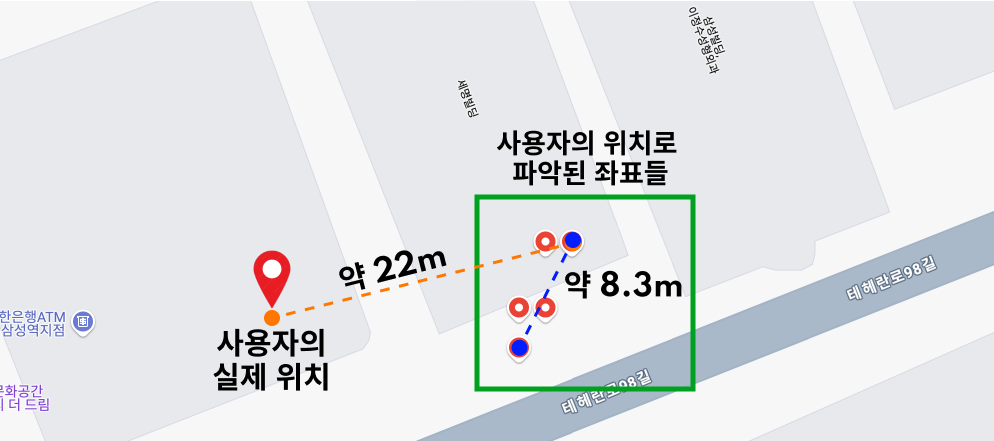
 

### 2-2. 사용자가 직접 자신의 위치를 설정하도록 하여 위치 정확도를 높이자.

API를 통해 파악한 사용자의 위치가 지도에 표시되고, 해당 위치가 정확하지 않다면 수정할 수 있도록 하는 기능을 하는 화면을 추가하여 사용자의 위치 정확도를 높였습니다.

해당 화면에 진입하면 먼저 휴대폰으로 측정된 위치가 지도에 표시되어 있고, 표시된 위치가 현재 위치와 다르다면 사용자가 직접 위치를 선택해 수정할 수 있도록 구현했습니다. 이를 통해 위치 정보의 정확도를 높이고, 사용자에게 조금 더 정확한 AR 경험을 제공할 수 있게 되었습니다.

사용자의 위치를 설정하는 화면이 추가되며, 아래 그림과 같은 흐름을 가지게 되었습니다.

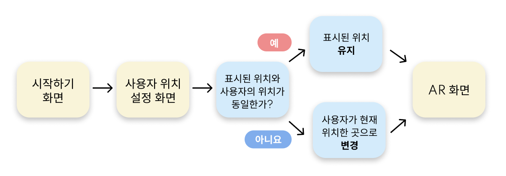

 

<table>
  <tr>
    <th>해당 화면 동작 미리보기</th>
  </tr>
  <tr>
    <td>
      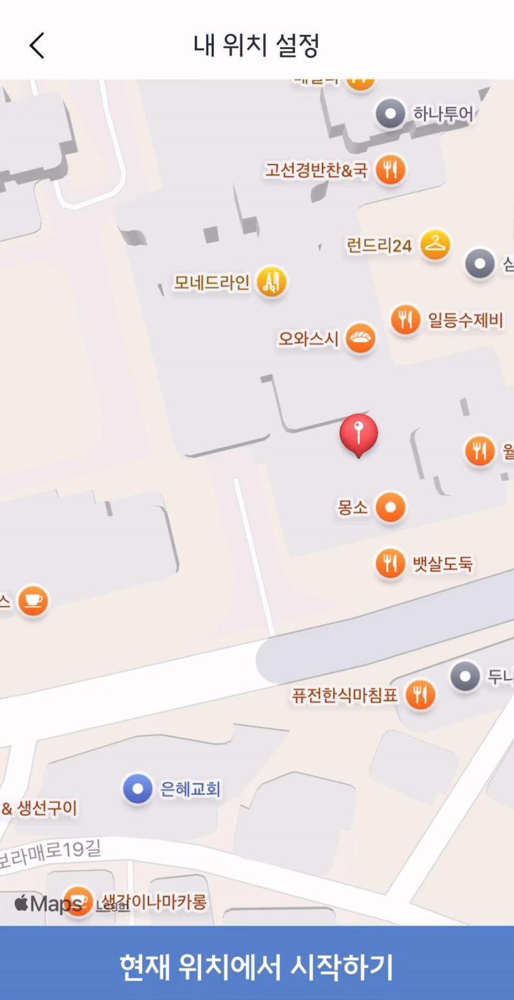
    </td>
  </tr>
</table>

 

# 챌린지

## 1. AR 화면을 통해 정확한 위치에 메모 띄우기

AR.js 라이브러리는 가상의 물체를 띄우기 위해 카메라를 기준으로 한 상대적 위치 계산을 통한 방식과 특정 위도와 경도를 활용한 절대적 위치 계산을 통한 방식 모두 지원합니다. 그러나 특정 위도와 경도를 사용하는 방식은 고도를 지원하지 않기 때문에 실내 환경에서도 동작해야 하는 이 애플리케이션에는 적합하지 않다고 판단했습니다. 이로 인해 프로젝트에서는 사용자의 카메라를 기준으로 하여 메모와의 상대적인 거리를 계산하는 방식을 사용하기로 했습니다.

<table>
  <tr>
    <th>절대적인 위치를 적용한 코드</th>
    <th>상대적인 위치를 적용한 코드</th>
  </tr>
  <tr>
    <td width="70%">
      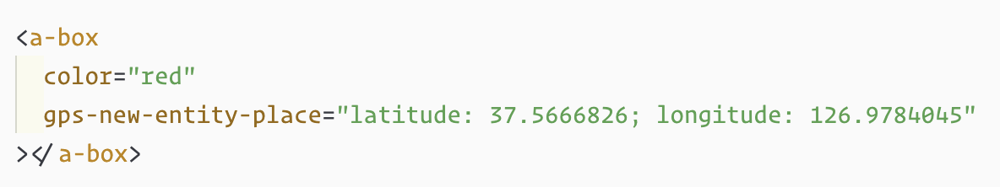
    </td>
    <td width="30%">
      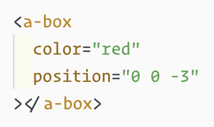
    </td>
  </tr>
</table>

사용자의 위치는 “내 위치 설정” 화면을 통해 파악하고, 해당 위치를 전역 상태에 저장합니다. 그뿐만 아니라 메모를 등록할 때도 메모가 위치하길 원하는 곳에 대한 위치 정보를 함께 저장합니다. 이처럼 사용자와 메모 각각의 위치 데이터를 파악하고 있기 때문에, 이를 활용하여 두 물체 사이의 거리를 파악할 수 있다고 판단했습니다.

 

### 1-1. 사용자와 메모 간 거리 계산 과정에서의 시행착오

**1) 하버사인 공식 시도하기**

처음에는 사용자와 메모 사이의 직선거리를 계산하기 위해 하버사인 공식을 사용하는 방법을 고려했습니다. 하버사인 공식은 두 위경도 사이의 직선거리를 계산하는 공식으로, 보통 지구 상의 두 점 사이의 거리를 구할 때 사용됩니다. 그렇기에 AR 화면에서는 직선거리 값이 아닌 가상 메모 물체의 position 속성의 x, y, z축 데이터가 각각 필요하므로, 하버사인 공식을 사용하는 것은 적합하지 않다고 판단했습니다.

 

**2) 전달받은 위도, 경도, 고도의 데이터에서 소수점 몇 자리까지가 유의미한 값일까?**

전달받은 위도와 경도의 데이터는 소수점 15자리까지 전달받지만, 거리 계산을 위해 유의미한 소수점 자리는 6자리까지만 필요하다는 것을 파악했습니다.

`react-native-geolocation` 라이브러리를 통해 전달받은 위도, 경도, 고도에 대한 데이터는 소수점 최대 15자리까지 전달받습니다. 한국을 기준으로 위도, 경도 데이터를 미터 단위로 변환한 값은 다음과 같습니다.

- 위도 1도 = 약 111,000m
- 경도 1도 = 약 88,804m

그러나 내 주변에 있는 메모를 띄우는 것이기 때문에, 사용자와의 거리가 위도와 경도가 1도까지 차이 나는 경우는 AR 화면에서 띄울 수 없습니다. 그렇기에 더 작은 단위로 변환한 값은 다음과 같습니다.

- 위도 0.000001 = 약 0.111m
- 경도 0.000001 = 약 0.089m

작은 단위로 변환한 결과를 통하여 소수점 6자리까지만 거리 계산에 유의미한 데이터가 되는 것으로 판단했습니다.

 

**3) 사용자와 메모 사이의 위도와 경도의 차이를 거리(m)로 계산하기**

위도와 경도를 미터 단위로 변환하여 사용자와 메모 사이의 거리를 계산하는 공식은 다음과 같습니다.

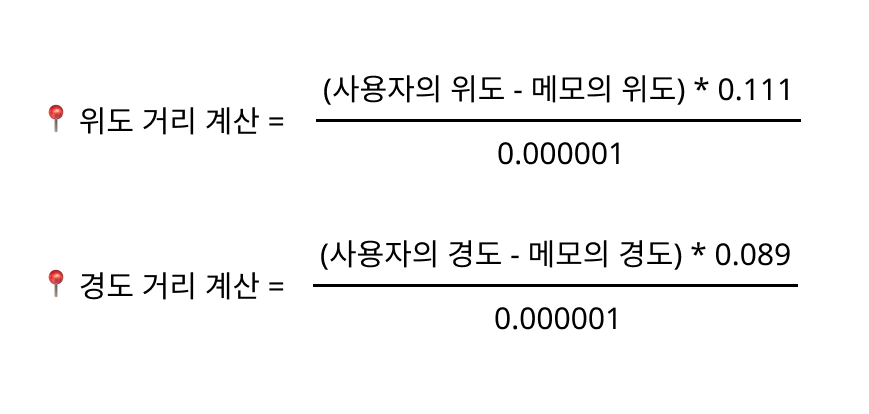
 

이 계산 식을 사용하여 AR 화면에 사용자 주변에 있는 메모를 표시할 수 있는 로직을 구현했습니다. 사용자가 AR 화면으로 진입하면, 사용자의 현재 위치와 등록된 메모들의 위도와 경도 데이터를 가지고 거리를 계산합니다. 그리고 계산된 거리를 기준으로 사용자의 현재 위치에서 100m 이내에 있는 메모만 AR 화면에 표시되도록 설정했습니다.

 

### 1-2. 여전히 정확하지 않은 메모의 위치 문제

사용자와 메모 사이의 거리 계산 식을 구현했음에도 불구하고, 메모의 위치가 여전히 정확하지 않게 표시되는 문제가 발생하고 있습니다. 예를 들어, 공중에 떠 있던 메모가 카메라보다 아래에 있거나 사라지는 경우가 나타나고 있습니다.

해당 문제가 발생하는 주요 원인으로 다음과 같이 추측하고 있습니다.

- 정확하지 않은 위치 데이터

: 사용자가 자신의 위치를 직접 설정하면서 이전보다 위치 정확도를 높이는 데 성공했지만, GPS 데이터 자체의 한계 때문에 여전히 오차가 발생하고 있습니다. 이러한 오차는 메모를 등록할 때의 위치 데이터에서도 동일하게 발생하고 있습니다.

**앞으로의 개선 사항**

현재까지는 사용자가 자신의 위치에 대한 정확도를 높일 수 있도록 구현하였으며, 두 위 경도를 사용하여 상대적 거리를 계산하는 식을 적용했습니다. 그러나 위치 데이터가 완전히 정확해진 것은 아니기에 메모를 등록할 당신의 주변 환경 등을 함께 저장하여, AR 화면에서 메모의 위치를 표시할 때 저장한 주변 환경을 참고할 수 있도록 하는 등의 추가적인 기능 구현을 시도해볼 예정입니다.

 

# 회고

이번 개인 프로젝트를 시작하며 처음 접하는 React Native와 AR 기술을 공부하고 적용해야 한다는 점에서 부담이 컸습니다. 하지만 미리 걱정하기보다는 개발 과정에서 마주하는 문제를 하나씩 해결하는 데에 집중하자는 생각으로 시작했습니다.

이전 팀 프로젝트에서는 팀원들과 문제에 대해 다양한 의견을 나누며 해결할 수 있었지만, 개인 프로젝트는 모든 결정을 스스로 내려야 한다는 점이 어려웠습니다. 마주한 문제에 대해 최선의 방법을 찾기 위해 다양한 방안들을 찾고, 시도한 결과들을 꼼꼼히 기록하며 해결 방법을 찾아 나갔습니다. 비록 모든 방안들로 문제가 해결되진 않았지만, 시도한 방법을 참고하며 다른 방법들을 시도할 수 있었고 오히려 이 방식으로 문제를 해결하는 시간을 단축시킬 수 있었습니다.

이 프로젝트를 통해 스스로 문제를 정의하고 해결해 나가는 능력의 중요성을 배웠습니다. 앞으로도 이러한 태도로 새로운 기술과 도전을 적극적으로 마주하고 싶습니다.
